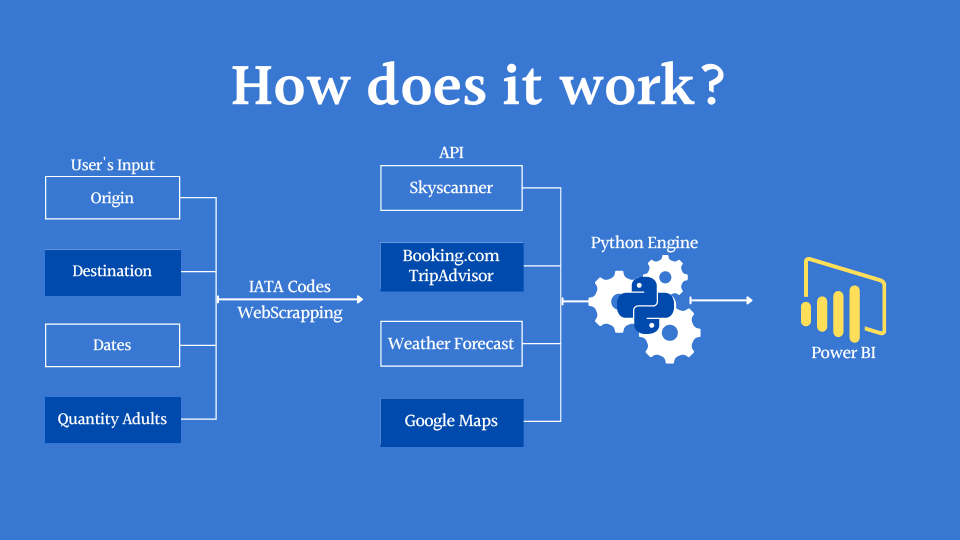

## TravelHero - Power BI & Python Powered "Last Minute" vacation planner.

  

&nbsp;

## The Idea behind everything.

While exploring the many travel APIs out there, the problem came from wanting to create a beautiful no-hassle application that could give me any destination in the blink of an eye, with all the nearby amenities & entertainment along with the prices, weather for the day that the user would be staying there.

  

## TravelHero consists of several separate steps:

- User's Interface: Tkinter - Receives the dates, origin, destination, and number of passengers.
- WebsCrapping Cities Coordinates: Using Json connector to scrap from techslides.com the long & lat of all the main cities.
- Weather Report: Weather Forecast's API Consult based on the destination coordinates.
- IATA Codes: Webscrapping the IATA codes for every airport worldwide.
- Skyscanner: Using IATA Codes, the number of passengers and the dates the user provides to get the flights.
- Hotels(GoogleMaps): Consulting Google Maps APIs to find the nearest hotels and entertainment based on the destination's coordinates.
- Power BI Deployment: All the code is built within Power BI to refresh on demand and showcase the results like any travel app.

### More About Me...
Find me on [LinkedIn](https://www.linkedin.com/in/danieljmendezb/)

